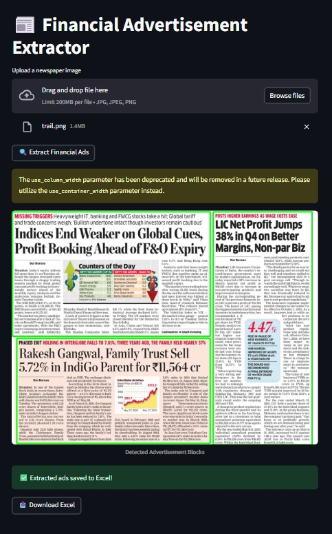

# 📰 Financial Advertisement Extractor

**Automate the extraction of financial ads from scanned newspaper pages using Computer Vision, OCR, and Large Language Models (LLMs).**



---

## 🚀 Project Overview

This project aims to detect and extract **financial advertisements** from newspaper images. It combines **OpenCV** for image preprocessing, **OCR** for text extraction, and **LLMs** (like GPT-4 or Hugging Face models) for financial ad classification.

### 🔍 Key Features

- Detects text blocks using OpenCV
- Extracts text using PyTesseract or EasyOCR
- Classifies blocks using LLMs (GPT-4, Llama 3, or Hugging Face)
- Exports detected financial ads to Excel

---
## 🖼️ System Architecture
```
Newspaper Image
│
▼
Image Preprocessing (OpenCV)
│
▼
Block Detection & OCR (PyTesseract / EasyOCR)
│
▼
Financial Ad Classification (LLM)
│
▼
Excel Storage (Pandas)
```

---

## 🧪 Tech Stack

| Component        | Technology                     |
|------------------|---------------------------------|
| Image Processing | OpenCV, PIL                     |
| OCR              | PyTesseract, EasyOCR            |
| LLM              | GPT-4 / Llama 3 / Hugging Face  |
| Data Storage     | Pandas, Excel                   |
| Frontend         | Streamlit                       |
| Backend          | Flask                           |
| Language         | Python                          |

---

## 🧰 Setup Instructions

### 1. 🐍 Install Dependencies

```bash
pip install -r requirements.txt
 ````

### 2. 🚦 Run Backend API (Flask)

```bash
python app.py
 ````

### 3. 💻 Launch Frontend App (Streamlit)

```bash
streamlit run streamlit_ui.py
 ````
### 📌 Use Cases
📊 Financial Analysts: Extract ads for trend analysis

📰 Media Agencies: Automate ad tracking

📈 Marketing Teams: Monitor competitor presence


